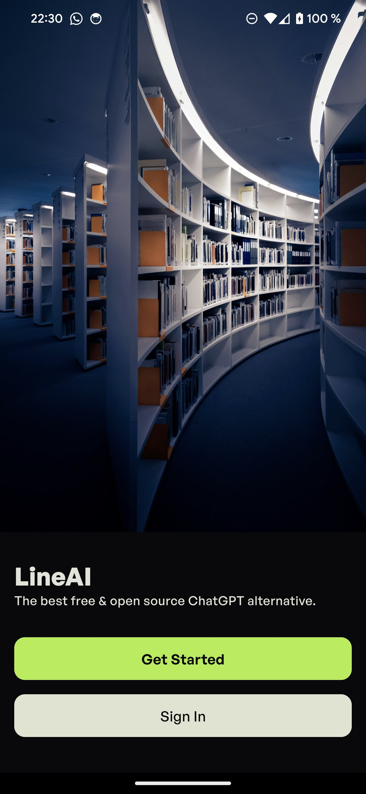
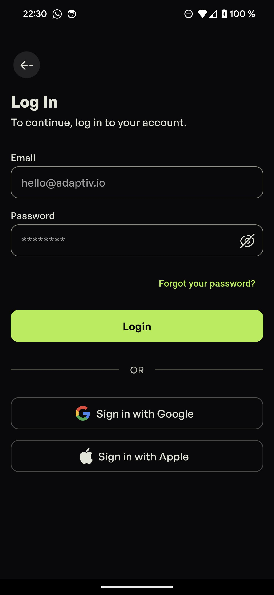
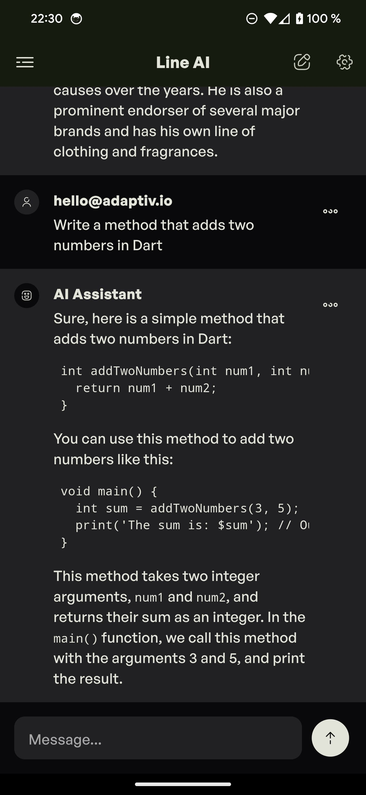
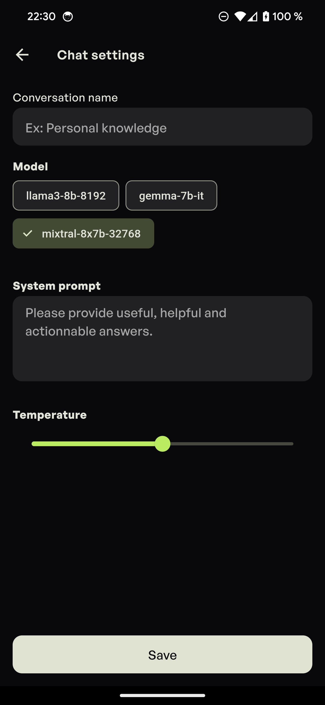

# LineAI

Open source mobile client for [Groq](https://groq.com/)

> /!\ This project is still in early stages. Please report any bugs or
> suggestions on [GitHub](https://github.com/stevenosse/lineai/issues)

## Getting started

### Tech stack
This projects uses:

- [Supabase](https://supabase.io/) as a backend. You can find more information
  on how to get started with Supabase on the
  [Supabase documentation](https://supabase.io/docs/guides/getting-started).

- [Flutter](https://flutter.dev/) for the frontend. You can find more information on how to get started
  with Flutter on the
  [Flutter documentation](https://flutter.dev/docs/get-started).

### Structure

- [lineai](./lineai/): The mobile app code
The project is organized as follows:
- [supabase](./supabase/): The "backend" code (all supabase functions and migrations)
- [docs](./docs/): Documentation

## Screenshots

 |
 |
 |

## Contributing

All contributions are welcome! If you are interested in contributing, please
fork this repository and create your own PR.
