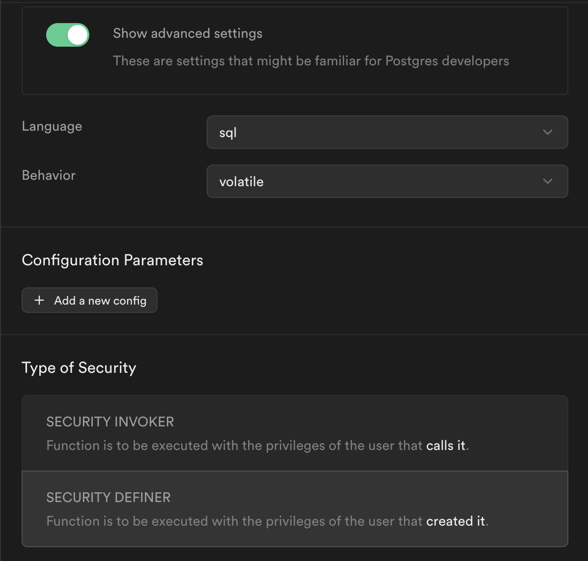

## Test locally
Base URl: http://127.0.0.1:54321/functions


## Security & Privacy

### Groq API Keys
Groq API Keys are encryption using `pgp_sym_encrypt` in the databse. 

1. Setup encryption

Execute this command in the SQL Editor:

```sql
-- Add a new encrypted column for groq_api_key
ALTER TABLE user_settings
ADD groq_api_key_encrypted TEXT;

-- Update the groq_api_key_encrypted column with encrypted values
UPDATE user_settings
SET
  groq_api_key_encrypted = pgp_sym_encrypt (groq_api_key, 
  (
    select decrypted_secret 
    from vault.decrypted_secrets 
    where name = 'default_encryption_key'
  )
);

-- Drop the original groq_api_key column
ALTER TABLE user_settings
DROP COLUMN groq_api_key;

-- Rename the groq_api_key_encrypted column to groq_api_key
ALTER TABLE user_settings
RENAME COLUMN groq_api_key_encrypted TO groq_api_key;
```

2. Read the encrypted value
Groq API Keys are read from the `groq_api_key` column in the database. We use a database function to encrypt the value.

```sql
select 
  pgp_sym_decrypt(groq_api_key::bytea, (
    select decrypted_secret 
    from vault.decrypted_secrets 
    where name = 'default_encryption_key'
  )) as groq_api_key
from public.user_settings
where user_id = read_groq_api_key.user_id
```

- Arguments: 
  - user_id : text

- Return type: text

- Settings:

